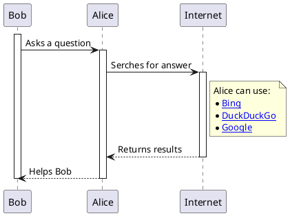

One of the more useful and powerful tools I have been using for the last few years is [PlantUML](https://plantuml.com/). PlantUML is a Domain Specific Language which allows you to create diagrams with code, many types of diagram. But why would you want to create a diagram in a DSL, rather than a dedicated tool such as [draw.io](https://www.drawio.com/)? My background is in software development, so I am used to looking at lines of code. But I find that if I have a tool that is responsible for layout then I am much less concerned with how the diagram looks, and more concerned with the information that the diagram is conveying.

There are all sorts of conversations possible around diagrams, and the philosophy of diagrams. For example, I believe it's not just enough for a diagram to be accurate, but it must flow (that is I shouldn't need to jump from place to place to understand it), and the diagram should be focussed in the information it is trying to convey. Another (personal) reason for using a DSL over a diagramming tool is that I find I am much more focussed on solving the issue at hand. But when I am using a diagramming tool I find it very easy to lose focus, for example becoming concerned with the layout of the diagram, and are those arrows aligned etc.?

The true purpose of this post is *not* to discuss diagrams and diagramming philosophy, but how I got the [Docker PlantUML Server](https://hub.docker.com/r/plantuml/plantuml-server) working with the [Dev Container](https://github.com/steve-codemunkies/steve-codemunkies.github.io/blob/main/.devcontainer/Dockerfile) I use when working on this blog.

My first port of call (unusually) was the [VS Code - Customize Dev Containers in VS Code with Dockerfiles and Docker Compose](https://youtu.be/p9L7YFqHGk4?si=E5SK21VF3hxStEWs) video on YouTube. This then took me to [Using Images, Dockerfiles, and Docker Compose](https://containers.dev/guide/dockerfile). And from this I learned that I was most of the way there already. To get PlantUML working I'd need a few steps:

0. Clean up the existing [Dockerfile](https://github.com/steve-codemunkies/steve-codemunkies.github.io/blob/main/.devcontainer/Dockerfile) and fix deprecations in [devcontainer.json](https://github.com/steve-codemunkies/steve-codemunkies.github.io/blob/main/.devcontainer/devcontainer.json)
1. Create a new [docker-compose.yml](https://github.com/steve-codemunkies/steve-codemunkies.github.io/blob/main/.devcontainer/docker-compose.yml) that initially just uses the existing [Dockerfile](https://github.com/steve-codemunkies/steve-codemunkies.github.io/blob/main/.devcontainer/Dockerfile)
2. Convert [devcontainer.json](https://github.com/steve-codemunkies/steve-codemunkies.github.io/blob/main/.devcontainer/devcontainer.json) to use the new [docker-compose.yml](https://github.com/steve-codemunkies/steve-codemunkies.github.io/blob/main/.devcontainer/docker-compose.yml)
3. Extend the [docker-compose.yml](https://github.com/steve-codemunkies/steve-codemunkies.github.io/blob/main/.devcontainer/docker-compose.yml) to include the [Docker PlantUML Server](https://hub.docker.com/r/plantuml/plantuml-server)

## Initial `docker-compose.yml` and `devcontainer.json` changes

Based on the information in [Using Images, Dockerfiles, and Docker Compose](https://containers.dev/guide/dockerfile) I quickly pieced together a simple [`docker-compose.yml`](https://github.com/steve-codemunkies/steve-codemunkies.github.io/blob/main/.devcontainer/docker-compose.yml) that simply started my dev container. My reason for doing this is simple: I'm already using a `Dockerfile`, so swapping to use docker compose (even with just the one container) should be straightforward and continue to work.

```yaml
version: '3.0'
services:
  devcontainer:
    build:
      context: .
      dockerfile: Dockerfile
      args:
        VARIANT: "3.1"
        INSTALL_NODE: "true"
        NODE_VERSION: "lts/*"
    volumes:
      - ../..:/workspaces:cached
    command: sleep infinity
```

For the most part the compose file transposes the arguments from the [`devcontainer.json`](https://github.com/steve-codemunkies/steve-codemunkies.github.io/blob/main/.devcontainer/devcontainer.json).

## Extending to use PlantUML

Running the PlantUML Jetty server is straightforward:

```sh
docker run -d -p 8080:8080 plantuml/plantuml-server:jetty
```

The only thing that needs configuring is the port (8080) so that the server can be accessed. Based on the [documentation](https://github.com/plantuml/plantuml-server) setting the argument `BASE_URL` alters the url used to access the server, so I have set this to `plantuml`, making the url to access the server `http://localhost:8080/plantuml`.

```yml
  plantuml:
    image: plantuml/plantuml-server:jetty
    container_name: plantuml-server
    ports:
      - 8080:8080
    environment:
      - BASE_URL=plantuml
```

Restarting the dev container and checking in docker desktop reveals that there are now two containers running:


And indeed we can access the server using `http://localhost:8080/plantuml`. However when I tried to preview [`2024-09-16-test-diagram.plantuml`](https://github.com/steve-codemunkies/steve-codemunkies.github.io/blob/main/assets/2024-09-16-test-diagram.plantuml) (I've installed the [jebbs PlantUML extension](https://marketplace.visualstudio.com/items?itemName=jebbs.plantuml)/[documentation](https://github.com/qjebbs/vscode-plantuml)) I was getting a "connection refused" error. The reason for this is that the docker had not been configured to allow container to container network comms. Because I'm using a dev container VS Code is running as a server within the container, so this container needs configuring to allow it to query the Plant UML server over port 8080. The following diagram shows the relationships between the piees of software:


The answer was in the [Using Images, Dockerfiles, and Docker Compose](https://containers.dev/guide/dockerfile) article and lead me to this complete [`docker-compose.yml`](https://github.com/steve-codemunkies/steve-codemunkies.github.io/blob/main/.devcontainer/docker-compose.yml):

```yaml
version: '3.0'
services:
  devcontainer:
    build:
      context: .
      dockerfile: Dockerfile
      args:
        VARIANT: "3.1"
        INSTALL_NODE: "true"
        NODE_VERSION: "lts/*"
    volumes:
      - ../..:/workspaces:cached
    command: sleep infinity
    container_name: codemunkies-github
    network_mode: service:plantuml

  plantuml:
    image: plantuml/plantuml-server:jetty
    container_name: plantuml-server
    ports:
      - 8080:8080
    environment:
      - BASE_URL=plantuml
```

The key line is the `network_mode` extry under devcontainer, this instructs docker to allow the dev container to access the `plantuml` container via the network.

## How to include an SVG in a page?

This is the [Plant UML diagram](/assets/2024-09-16-test-diagram.plantuml) I'll be using:



Because this is a Github Pages blog I initially went with the markdown methods for displaying an image:

```md

```

While this does display the image, it is not interactive. This can be fixed by having the server generate an image map and including that, but this is the 21st century. A moment or two with the least worst search engine brought me to [The Best Way to Embed SVG on HTML (2021)](https://vecta.io/blog/best-way-to-embed-svg) from vecta.io. So now my page has the following in it:

```html
<object type="image/svg+xml" data="/assets/2024-09-16-test-diagram.svg">
    <!-- Your fall back here -->
    
</object>
```

Which renders a fully interactive diagram:

<object type="image/svg+xml" data="/assets/2024-09-16-test-diagram.svg">
    <!-- Your fall back here -->
    
</object>

## Wrap up

If you are using a dev container for development extending this out to include other containers via docker compose is a straight forward process. Assuming you are able to find or create an image you can spin up database servers, queue servers, or as here an image generation server. The one minor gotcha to remember is that you are developing within a container, and will therefore need to setup some minimal docker networking to make it all work.
